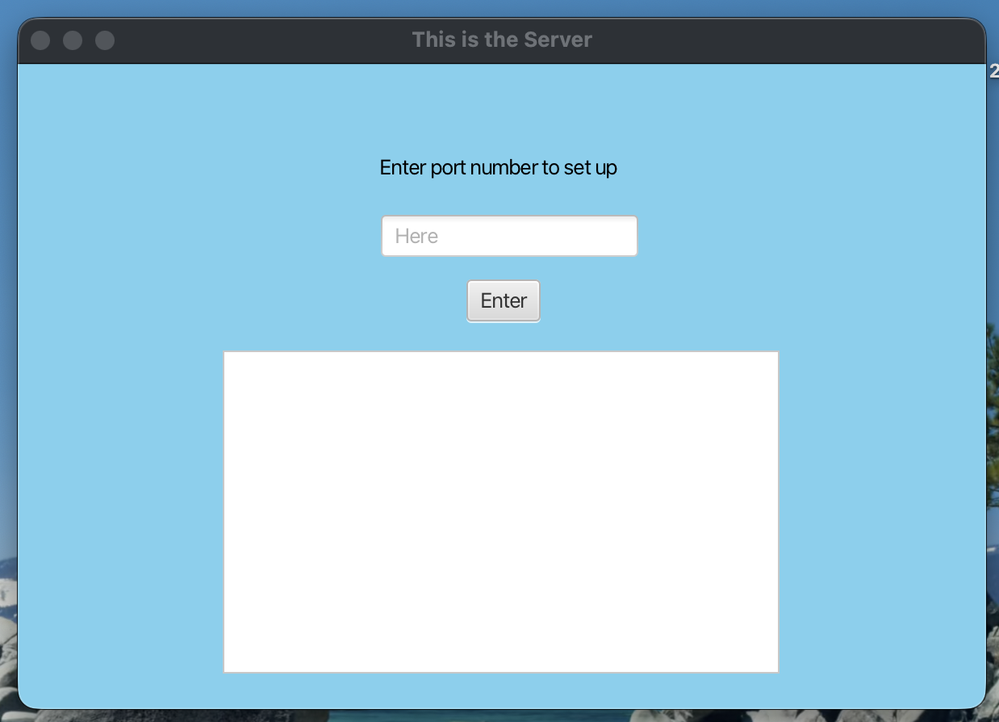
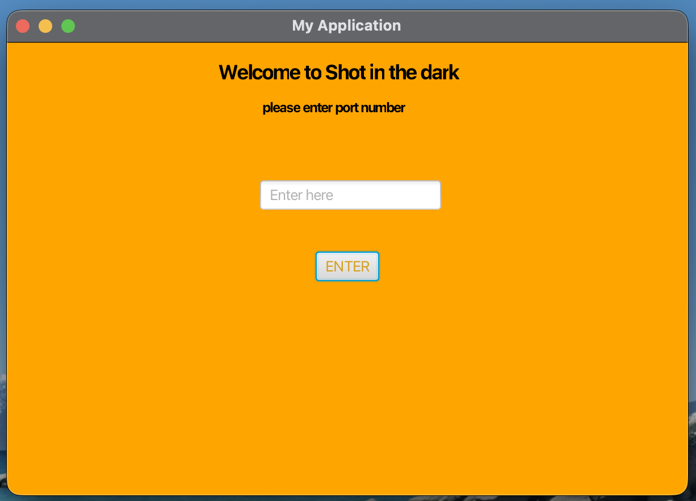

# Java Client/Server Game

A JavaFX client/server game application built with Java and Maven.

The project uses a separate client and server architecture. The server manages game logic and client connections, while the client provides the graphical interface used to interact with the game.

## Features

- JavaFX graphical user interface
- Separate client and server applications
- TCP socket communication
- Multi-stage game flow
- Guess tracking and game-state updates
- Server-side game logic
- JUnit tests for core game behavior
- Maven-based build system

## Technologies

- Java
- JavaFX
- Maven
- TCP Sockets
- FXML
- JUnit

Architecture
The application is split into two Maven projects:

Server
The server:
- Opens a socket and listens for client connections
- Maintains the game state
- Processes guesses sent by the client
- Determines win/loss conditions
- Sends updated game information back to the client
- Provides a JavaFX interface for monitoring the server

Client
The client:
- Connects to the server using 127.0.0.1
- Provides the user interface through JavaFX and FXML
- Sends player input to the server
- Receives game-state updates from the server
- Updates the interface based on server responses

Screenshots: 

Server

Client

Gameplay

Requirements
- Java 17 or newer
- Maven
- JavaFX dependencies are managed through Maven

Building the project:

Server: 
from the server directory create a terminal and write: 

mvn clean test 

Client: 
from the client directory create a terminal and write: 

mvn clean compile

#### Running the App:
The server must be started before the client.

1. Start the server: 
cd server
mvn javafx:run

2. Start the Client:
cs client
mvn javafx:run

3. Enter a server port number to host the games: 
Example: port number 500

The client will connect to that same port number and begin 
the connection. 

What I Learned

This project provided experience with:
- Designing a client/server architecture
- TCP socket communication
- JavaFX user interface development
- FXML controller integration
- Maven dependency and build management
- Unit testing with JUnit
- Refactoring legacy code without breaking application behavior
- Debugging client/server communication

Future Improvements

Possible improvements include:
- Support for multiple remote clients
- Configurable host and port settings
- Improved error handling and logging
- Packaging the client and server as standalone applications
- Expanded automated test coverage
- Improved UI stylingpwd
